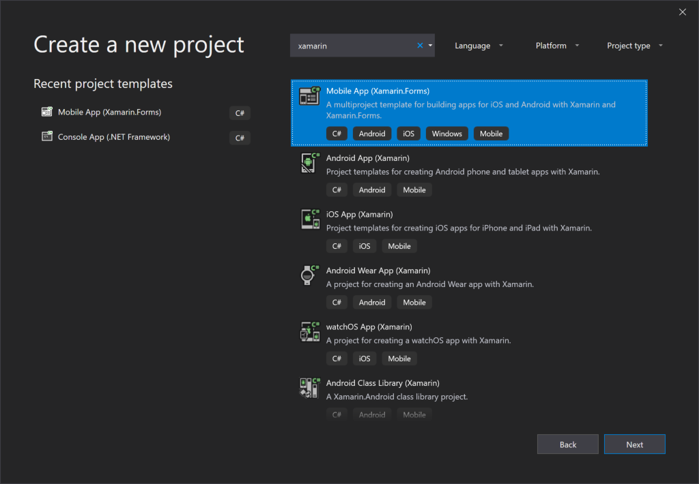
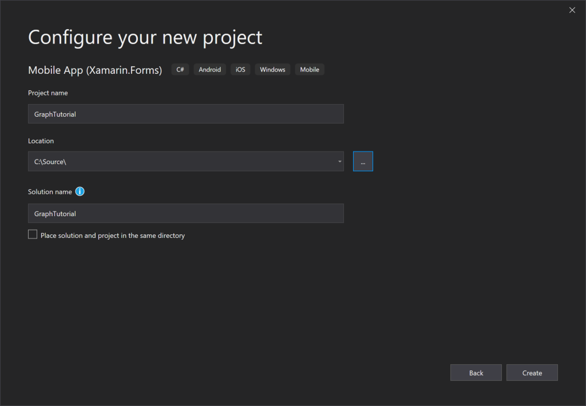

<!-- markdownlint-disable MD002 MD041 -->

1. <span data-ttu-id="975d4-101">打开 Visual Studio，然后选择 "**新建项目**"。</span><span class="sxs-lookup"><span data-stu-id="975d4-101">Open Visual Studio, and select **Create a new project**.</span></span>

1. <span data-ttu-id="975d4-102">在 "**创建新项目**" 对话框中，选择 "**移动应用（Xamarin. Forms）**"，然后选择 "**下一步**"。</span><span class="sxs-lookup"><span data-stu-id="975d4-102">In the **Create a new project** dialog, choose **Mobile App (Xamarin.Forms)**, then select **Next**.</span></span>

    

1. <span data-ttu-id="975d4-104">在 "**配置新项目**" 对话框中， `GraphTutorial`输入**项目名称**和**解决方案名称**，然后选择 "**创建**"。</span><span class="sxs-lookup"><span data-stu-id="975d4-104">In the **Configure a new project** dialog, enter `GraphTutorial` for the **Project name** and **Solution name**, then select **Create**.</span></span>

    > [!IMPORTANT]
    > <span data-ttu-id="975d4-105">确保为在这些实验室说明中指定的 Visual Studio 项目输入完全相同的名称。</span><span class="sxs-lookup"><span data-stu-id="975d4-105">Ensure that you enter the exact same name for the Visual Studio Project that is specified in these lab instructions.</span></span> <span data-ttu-id="975d4-106">Visual Studio 项目名称将成为代码中的命名空间的一部分。</span><span class="sxs-lookup"><span data-stu-id="975d4-106">The Visual Studio Project name becomes part of the namespace in the code.</span></span> <span data-ttu-id="975d4-107">这些指令中的代码取决于与这些说明中指定的 Visual Studio 项目名称匹配的命名空间。</span><span class="sxs-lookup"><span data-stu-id="975d4-107">The code inside these instructions depends on the namespace matching the Visual Studio Project name specified in these instructions.</span></span> <span data-ttu-id="975d4-108">如果使用其他项目名称，则代码将不会编译，除非您调整所有命名空间以匹配您在创建项目时输入的 Visual Studio 项目名称。</span><span class="sxs-lookup"><span data-stu-id="975d4-108">If you use a different project name the code will not compile unless you adjust all the namespaces to match the Visual Studio Project name you enter when you create the project.</span></span>

    

1. <span data-ttu-id="975d4-110">在 "**新建跨平台应用程序**" 对话框中，选择 "**空白**" 模板，然后选择要在 "**平台**" 下构建的平台。</span><span class="sxs-lookup"><span data-stu-id="975d4-110">In the **New Cross Platform App** dialog, select the **Blank** template, and select the platforms you want to build under **Platforms**.</span></span> <span data-ttu-id="975d4-111">选择 **"确定"** 以创建解决方案。</span><span class="sxs-lookup"><span data-stu-id="975d4-111">Select **OK** to create the solution.</span></span>

    

## <a name="install-packages"></a><span data-ttu-id="975d4-113">安装程序包</span><span class="sxs-lookup"><span data-stu-id="975d4-113">Install packages</span></span>

<span data-ttu-id="975d4-114">在继续之前，请安装稍后将使用的一些其他 NuGet 包。</span><span class="sxs-lookup"><span data-stu-id="975d4-114">Before moving on, install some additional NuGet packages that you will use later.</span></span>

- <span data-ttu-id="975d4-115">用于处理 Azure AD 身份验证和令牌管理的[Microsoft Identity。](https://www.nuget.org/packages/Microsoft.Identity.Client/)</span><span class="sxs-lookup"><span data-stu-id="975d4-115">[Microsoft.Identity.Client](https://www.nuget.org/packages/Microsoft.Identity.Client/) to handle Azure AD authentication and token management.</span></span>
- <span data-ttu-id="975d4-116">用于调用 Microsoft Graph 的[microsoft](https://www.nuget.org/packages/Microsoft.Graph/) graph。</span><span class="sxs-lookup"><span data-stu-id="975d4-116">[Microsoft.Graph](https://www.nuget.org/packages/Microsoft.Graph/) for making calls to the Microsoft Graph.</span></span>

1. <span data-ttu-id="975d4-117">选择 "**工具" > NuGet 包管理器 "> 程序包管理器控制台**"。</span><span class="sxs-lookup"><span data-stu-id="975d4-117">Select **Tools > NuGet Package Manager > Package Manager Console**.</span></span>

1. <span data-ttu-id="975d4-118">在 "程序包管理器控制台" 中，输入以下命令。</span><span class="sxs-lookup"><span data-stu-id="975d4-118">In the Package Manager Console, enter the following commands.</span></span>

    ```Powershell
    Install-Package Microsoft.Identity.Client -Version 4.10.0 -Project GraphTutorial
    Install-Package Microsoft.Identity.Client -Version 4.10.0 -Project GraphTutorial.Android
    Install-Package Microsoft.Identity.Client -Version 4.10.0 -Project GraphTutorial.iOS
    Install-Package Microsoft.Graph -Version 3.0.1 -Project GraphTutorial
    ```

## <a name="design-the-app"></a><span data-ttu-id="975d4-119">设计应用程序</span><span class="sxs-lookup"><span data-stu-id="975d4-119">Design the app</span></span>

<span data-ttu-id="975d4-120">首先更新`App`类以添加用于跟踪身份验证状态和已登录用户的变量。</span><span class="sxs-lookup"><span data-stu-id="975d4-120">Start by updating the `App` class to add variables to track the authentication state and the signed-in user.</span></span>

1. <span data-ttu-id="975d4-121">在 "**解决方案资源管理器**" 中，展开 " **GraphTutorial** " 项目，然后展开**app.xaml**文件。</span><span class="sxs-lookup"><span data-stu-id="975d4-121">In **Solution Explorer**, expand the **GraphTutorial** project, then expand the **App.xaml** file.</span></span> <span data-ttu-id="975d4-122">打开**App.xaml.cs**文件，并将以下`using`语句添加到文件顶部。</span><span class="sxs-lookup"><span data-stu-id="975d4-122">Open the **App.xaml.cs** file and add the following `using` statements to the top of the file.</span></span>

    ```csharp
    using System.ComponentModel;
    using System.IO;
    using System.Reflection;
    using System.Threading.Tasks;
    ```

1. <span data-ttu-id="975d4-123">将`INotifyPropertyChanged`接口添加到类声明中。</span><span class="sxs-lookup"><span data-stu-id="975d4-123">Add the `INotifyPropertyChanged` interface to the class declaration.</span></span>

    ```csharp
    public partial class App : Application, INotifyPropertyChanged
    ```

1. <span data-ttu-id="975d4-124">将以下属性添加到`App`类中。</span><span class="sxs-lookup"><span data-stu-id="975d4-124">Add the following properties to the `App` class.</span></span>

    :::code language="csharp" source="../demo/GraphTutorial/GraphTutorial/App.xaml.cs" id="GlobalPropertiesSnippet":::

1. <span data-ttu-id="975d4-125">将以下函数添加到`App`类中。</span><span class="sxs-lookup"><span data-stu-id="975d4-125">Add the following functions to the `App` class.</span></span> <span data-ttu-id="975d4-126">`SignIn`、 `SignOut`和`GetUserInfo`函数现在只是占位符。</span><span class="sxs-lookup"><span data-stu-id="975d4-126">The `SignIn`, `SignOut`, and `GetUserInfo` functions are just placeholders for now.</span></span>

    ```csharp
    public async Task SignIn()
    {
        await GetUserInfo();

        IsSignedIn = true;
    }

    public async Task SignOut()
    {
        UserPhoto = null;
        UserName = string.Empty;
        UserEmail = string.Empty;
        IsSignedIn = false;
    }

    private async Task GetUserInfo()
    {
        UserPhoto = ImageSource.FromStream(() => GetUserPhoto());
        UserName = "Adele Vance";
        UserEmail = "adelev@contoso.com";
    }

    private Stream GetUserPhoto()
    {
        // Return the default photo
        return Assembly.GetExecutingAssembly().GetManifestResourceStream("GraphTutorial.no-profile-pic.png");
    }
    ```

1. <span data-ttu-id="975d4-127">`GetUserPhoto`函数现在返回默认照片。</span><span class="sxs-lookup"><span data-stu-id="975d4-127">The `GetUserPhoto` function returns a default photo for now.</span></span> <span data-ttu-id="975d4-128">你可以提供自己的文件，也可以从[GitHub](https://github.com/microsoftgraph/msgraph-training-xamarin/blob/master/tutorial/images/no-profile-pic.png)中的示例中下载所使用的文件。</span><span class="sxs-lookup"><span data-stu-id="975d4-128">You can either supply your own file, or you can download the one used in the sample from [GitHub](https://github.com/microsoftgraph/msgraph-training-xamarin/blob/master/tutorial/images/no-profile-pic.png).</span></span> <span data-ttu-id="975d4-129">如果您使用自己的文件，请将其重命名为**no-profile-pic**。</span><span class="sxs-lookup"><span data-stu-id="975d4-129">If you use your own file, rename it to **no-profile-pic.png**.</span></span>

1. <span data-ttu-id="975d4-130">将文件复制到 **/GraphTutorial/GraphTutorial**目录。</span><span class="sxs-lookup"><span data-stu-id="975d4-130">Copy the file to the **./GraphTutorial/GraphTutorial** directory.</span></span>

1. <span data-ttu-id="975d4-131">在 "**解决方案资源管理器**" 中右键单击该文件，然后选择 "**属性**"。</span><span class="sxs-lookup"><span data-stu-id="975d4-131">Right-click the file in **Solution Explorer** and select **Properties**.</span></span> <span data-ttu-id="975d4-132">在 "**属性**" 窗口中，将 "**生成操作**" 的值更改为 "**嵌入的资源**"。</span><span class="sxs-lookup"><span data-stu-id="975d4-132">In the **Properties** window, change the value of **Build Action** to **Embedded resource**.</span></span>

    

### <a name="app-navigation"></a><span data-ttu-id="975d4-134">应用程序导航</span><span class="sxs-lookup"><span data-stu-id="975d4-134">App navigation</span></span>

<span data-ttu-id="975d4-135">在本节中，您将把应用程序的主页面更改为一个[主-详细信息页面](/xamarin/xamarin-forms/app-fundamentals/navigation/master-detail-page)。</span><span class="sxs-lookup"><span data-stu-id="975d4-135">In this section, you'll change the application's main page to a [Master-Detail page](/xamarin/xamarin-forms/app-fundamentals/navigation/master-detail-page).</span></span> <span data-ttu-id="975d4-136">这将提供导航菜单，以便在应用程序中的视图之间切换。</span><span class="sxs-lookup"><span data-stu-id="975d4-136">This will provide a navigation menu to switch between view in the app.</span></span>

1. <span data-ttu-id="975d4-137">打开**GraphTutorial**项目中的**MainPage**文件，并将其内容替换为以下内容。</span><span class="sxs-lookup"><span data-stu-id="975d4-137">Open the **MainPage.xaml** file in the **GraphTutorial** project and replace its contents with the following.</span></span>

    :::code language="xaml" source="../demo/GraphTutorial/GraphTutorial/MainPage.xaml":::

#### <a name="implement-the-menu"></a><span data-ttu-id="975d4-138">实现菜单</span><span class="sxs-lookup"><span data-stu-id="975d4-138">Implement the menu</span></span>

1. <span data-ttu-id="975d4-139">右键单击 " **GraphTutorial** " 项目，然后依次选择 "**添加**"、"**新建文件夹**"。</span><span class="sxs-lookup"><span data-stu-id="975d4-139">Right-click the **GraphTutorial** project and select **Add**, then **New Folder**.</span></span> <span data-ttu-id="975d4-140">将文件夹`Models`命名为。</span><span class="sxs-lookup"><span data-stu-id="975d4-140">Name the folder `Models`.</span></span>

1. <span data-ttu-id="975d4-141">右键单击 "**模型**" 文件夹，然后依次选择 "**添加**"、"**类 ...**"。命名该类`NavMenuItem`并选择 "**添加**"。</span><span class="sxs-lookup"><span data-stu-id="975d4-141">Right-click the **Models** folder and select **Add**, then **Class...**. Name the class `NavMenuItem` and select **Add**.</span></span>

1. <span data-ttu-id="975d4-142">打开 " **NavMenuItem.cs** " 文件，并将其内容替换为以下内容。</span><span class="sxs-lookup"><span data-stu-id="975d4-142">Open the **NavMenuItem.cs** file and replace its contents with the following.</span></span>

    :::code language="csharp" source="../demo/GraphTutorial/GraphTutorial/Models/NavMenuItem.cs" id="NavMenuItemSnippet":::

1. <span data-ttu-id="975d4-143">右键单击 " **GraphTutorial** " 项目，然后依次选择 "**添加**"、"**新建项目 ...**"。选择 "**内容页面**" 并命名`MenuPage`页面。</span><span class="sxs-lookup"><span data-stu-id="975d4-143">Right-click the **GraphTutorial** project and select **Add**, then **New Item...**. Choose **Content Page** and name the page `MenuPage`.</span></span> <span data-ttu-id="975d4-144">选择“**添加**”。</span><span class="sxs-lookup"><span data-stu-id="975d4-144">Select **Add**.</span></span>

1. <span data-ttu-id="975d4-145">打开**MenuPage**文件，并将其内容替换为以下内容。</span><span class="sxs-lookup"><span data-stu-id="975d4-145">Open the **MenuPage.xaml** file and replace its contents with the following.</span></span>

    :::code language="xaml" source="../demo/GraphTutorial/GraphTutorial/MenuPage.xaml":::

1. <span data-ttu-id="975d4-146">展开 "**解决方案资源管理器**" 中的 " **MenuPage** "，然后打开 " **MenuPage.xaml.cs** " 文件。</span><span class="sxs-lookup"><span data-stu-id="975d4-146">Expand **MenuPage.xaml** in **Solution Explorer** and open the **MenuPage.xaml.cs** file.</span></span> <span data-ttu-id="975d4-147">将其内容替换为以下内容。</span><span class="sxs-lookup"><span data-stu-id="975d4-147">Replace its contents with the following.</span></span>

    :::code language="csharp" source="../demo/GraphTutorial/GraphTutorial/MenuPage.xaml.cs" id="MenuPageSnippet":::

    > [!NOTE]
    > <span data-ttu-id="975d4-148">Visual Studio 将报告**MenuPage.xaml.cs**中的错误。</span><span class="sxs-lookup"><span data-stu-id="975d4-148">Visual Studio will report errors in **MenuPage.xaml.cs**.</span></span> <span data-ttu-id="975d4-149">这些错误将在后续步骤中予以解决。</span><span class="sxs-lookup"><span data-stu-id="975d4-149">These errors will be resolved in a later step.</span></span>

#### <a name="implement-the-welcome-page"></a><span data-ttu-id="975d4-150">实施欢迎页面</span><span class="sxs-lookup"><span data-stu-id="975d4-150">Implement the welcome page</span></span>

1. <span data-ttu-id="975d4-151">右键单击 " **GraphTutorial** " 项目，然后依次选择 "**添加**"、"**新建项目 ...**"。选择 "**内容页面**" 并命名`WelcomePage`页面。</span><span class="sxs-lookup"><span data-stu-id="975d4-151">Right-click the **GraphTutorial** project and select **Add**, then **New Item...**. Choose **Content Page** and name the page `WelcomePage`.</span></span> <span data-ttu-id="975d4-152">选择“**添加**”。</span><span class="sxs-lookup"><span data-stu-id="975d4-152">Select **Add**.</span></span> <span data-ttu-id="975d4-153">打开**WelcomePage**文件，并将其内容替换为以下内容。</span><span class="sxs-lookup"><span data-stu-id="975d4-153">Open the **WelcomePage.xaml** file and replace its contents with the following.</span></span>

    :::code language="xaml" source="../demo/GraphTutorial/GraphTutorial/WelcomePage.xaml":::

1. <span data-ttu-id="975d4-154">展开 "**解决方案资源管理器**" 中的 " **WelcomePage** "，然后打开 " **WelcomePage.xaml.cs** " 文件。</span><span class="sxs-lookup"><span data-stu-id="975d4-154">Expand **WelcomePage.xaml** in **Solution Explorer** and open the **WelcomePage.xaml.cs** file.</span></span> <span data-ttu-id="975d4-155">将以下函数添加到 `WelcomePage` 类。</span><span class="sxs-lookup"><span data-stu-id="975d4-155">Add the following function to the `WelcomePage` class.</span></span>

    :::code language="csharp" source="../demo/GraphTutorial/GraphTutorial/WelcomePage.xaml.cs" id="OnSignInSnippet":::

#### <a name="add-calendar-page"></a><span data-ttu-id="975d4-156">添加日历页</span><span class="sxs-lookup"><span data-stu-id="975d4-156">Add calendar page</span></span>

<span data-ttu-id="975d4-157">现在添加 "日历" 页。</span><span class="sxs-lookup"><span data-stu-id="975d4-157">Now add a calendar page.</span></span> <span data-ttu-id="975d4-158">这将是现在的占位符。</span><span class="sxs-lookup"><span data-stu-id="975d4-158">This will just be a placeholder for now.</span></span>

1. <span data-ttu-id="975d4-159">右键单击 " **GraphTutorial** " 项目，然后依次选择 "**添加**"、"**新建项目 ...**"。选择 "**内容页面**" 并命名`CalendarPage`页面。</span><span class="sxs-lookup"><span data-stu-id="975d4-159">Right-click the **GraphTutorial** project and select **Add**, then **New Item...**. Choose **Content Page** and name the page `CalendarPage`.</span></span> <span data-ttu-id="975d4-160">选择“**添加**”。</span><span class="sxs-lookup"><span data-stu-id="975d4-160">Select **Add**.</span></span>

#### <a name="update-mainpage-code-behind"></a><span data-ttu-id="975d4-161">更新 MainPage 代码隐藏</span><span class="sxs-lookup"><span data-stu-id="975d4-161">Update MainPage code-behind</span></span>

<span data-ttu-id="975d4-162">现在，已准备好所有页面，更新**MainPage**的代码隐藏。</span><span class="sxs-lookup"><span data-stu-id="975d4-162">Now that all of the pages are in place, update the code-behind for **MainPage.xaml**.</span></span>

1. <span data-ttu-id="975d4-163">展开 "**解决方案资源管理器**" 中的**MainPage** ，打开**MainPage.xaml.cs**文件，并将其全部内容替换为以下内容。</span><span class="sxs-lookup"><span data-stu-id="975d4-163">Expand **MainPage.xaml** in **Solution Explorer** and open the **MainPage.xaml.cs** file and replace its entire contents with the following.</span></span>

    :::code language="csharp" source="../demo/GraphTutorial/GraphTutorial/MainPage.xaml.cs" id="MainPageSnippet":::

1. <span data-ttu-id="975d4-164">保存所有更改。</span><span class="sxs-lookup"><span data-stu-id="975d4-164">Save all of your changes.</span></span> <span data-ttu-id="975d4-165">右键单击要运行的项目（Android、iOS 或 UWP），然后选择 "**设为启动项目**"。</span><span class="sxs-lookup"><span data-stu-id="975d4-165">Right-click the project that you want to run (Android, iOS, or UWP) and select **Set as StartUp Project**.</span></span> <span data-ttu-id="975d4-166">按**F5**或选择 "调试" > 在 Visual Studio 中**启动调试**。</span><span class="sxs-lookup"><span data-stu-id="975d4-166">Press **F5** or select **Debug > Start Debugging** in Visual Studio.</span></span>

    
