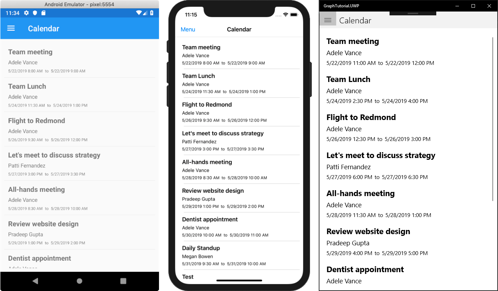

<!-- markdownlint-disable MD002 MD041 -->

<span data-ttu-id="724ce-101">在本练习中, 将把 Microsoft Graph 合并到应用程序中。</span><span class="sxs-lookup"><span data-stu-id="724ce-101">In this exercise you will incorporate the Microsoft Graph into the application.</span></span> <span data-ttu-id="724ce-102">对于此应用程序, 您将使用[microsoft graph 客户端库进行 .net](https://github.com/microsoftgraph/msgraph-sdk-dotnet)以调用 microsoft graph。</span><span class="sxs-lookup"><span data-stu-id="724ce-102">For this application, you will use the [Microsoft Graph Client Library for .NET](https://github.com/microsoftgraph/msgraph-sdk-dotnet) to make calls to Microsoft Graph.</span></span>

## <a name="get-calendar-events-from-outlook"></a><span data-ttu-id="724ce-103">从 Outlook 获取日历事件</span><span class="sxs-lookup"><span data-stu-id="724ce-103">Get calendar events from Outlook</span></span>

<span data-ttu-id="724ce-104">首先更新**GraphTutorial**项目中的**CalendarPage**文件。</span><span class="sxs-lookup"><span data-stu-id="724ce-104">Start by updating the **CalendarPage.xaml** file in the **GraphTutorial** project.</span></span> <span data-ttu-id="724ce-105">打开文件, 并将其内容替换为以下内容。</span><span class="sxs-lookup"><span data-stu-id="724ce-105">Open the file and replace its contents with the following.</span></span>

```xml
<?xml version="1.0" encoding="utf-8" ?>
<ContentPage xmlns="http://xamarin.com/schemas/2014/forms"
             xmlns:x="http://schemas.microsoft.com/winfx/2009/xaml"
             Title="Calendar"
             x:Class="GraphTutorial.CalendarPage">
    <ContentPage.Content>
        <StackLayout>
            <Editor x:Name="JSONResponse"
                    IsSpellCheckEnabled="False"
                    HorizontalOptions="FillAndExpand"
                    VerticalOptions="FillAndExpand"/>
        </StackLayout>
    </ContentPage.Content>
</ContentPage>
```

<span data-ttu-id="724ce-106">打开`CalendarPage.xaml.cs`并将以下`using`语句添加到文件顶部。</span><span class="sxs-lookup"><span data-stu-id="724ce-106">Open `CalendarPage.xaml.cs` and add the following `using` statements at the top of the file.</span></span>

```cs
using Newtonsoft.Json;
using Microsoft.Graph;
using System.ComponentModel;
using System.Collections.ObjectModel;
```

<span data-ttu-id="724ce-107">然后添加以下代码, 以获取用户的事件并显示 JSON 响应。</span><span class="sxs-lookup"><span data-stu-id="724ce-107">Then add the following code to get the user's events and display the JSON response.</span></span>

```cs
protected override async void OnAppearing()
{
    base.OnAppearing();

    // Get the events
    var events = await App.GraphClient.Me.Events.Request()
        .Select("subject,organizer,start,end")
        .OrderBy("createdDateTime DESC")
        .GetAsync();

    // Temporary
    JSONResponse.Text = JsonConvert.SerializeObject(events.CurrentPage, Formatting.Indented);
}
```

<span data-ttu-id="724ce-108">考虑中`OnAppearing`的代码执行的操作。</span><span class="sxs-lookup"><span data-stu-id="724ce-108">Consider what the code in `OnAppearing` is doing.</span></span>

- <span data-ttu-id="724ce-109">将调用的 URL 为`/v1.0/me/events`。</span><span class="sxs-lookup"><span data-stu-id="724ce-109">The URL that will be called is `/v1.0/me/events`.</span></span>
- <span data-ttu-id="724ce-110">`Select`函数将为每个事件返回的字段限制为仅供视图实际使用的字段。</span><span class="sxs-lookup"><span data-stu-id="724ce-110">The `Select` function limits the fields returned for each events to just those the view will actually use.</span></span>
- <span data-ttu-id="724ce-111">`OrderBy`函数按其创建日期和时间对结果进行排序, 最新项目最先开始。</span><span class="sxs-lookup"><span data-stu-id="724ce-111">The `OrderBy` function sorts the results by the date and time they were created, with the most recent item being first.</span></span>

<span data-ttu-id="724ce-112">您现在可以运行应用程序, 登录, 然后单击菜单中的 "**日历**" 导航项。</span><span class="sxs-lookup"><span data-stu-id="724ce-112">You can now run the app, sign in, and click the **Calendar** navigation item in the menu.</span></span> <span data-ttu-id="724ce-113">您应该会看到用户日历上的事件的 JSON 转储。</span><span class="sxs-lookup"><span data-stu-id="724ce-113">You should see a JSON dump of the events on the user's calendar.</span></span>

## <a name="display-the-results"></a><span data-ttu-id="724ce-114">显示结果</span><span class="sxs-lookup"><span data-stu-id="724ce-114">Display the results</span></span>

<span data-ttu-id="724ce-115">现在, 您可以将 JSON 转储替换为以用户友好的方式显示结果的内容。</span><span class="sxs-lookup"><span data-stu-id="724ce-115">Now you can replace the JSON dump with something to display the results in a user-friendly manner.</span></span> <span data-ttu-id="724ce-116">首先创建[绑定值转换器](/xamarin/xamarin-forms/xaml/xaml-basics/data-binding-basics#binding-value-converters), 将 Microsoft Graph 返回的[datetimetimezone type](/graph/api/resources/datetimetimezone?view=graph-rest-1.0)值转换为用户预期的日期和时间格式。</span><span class="sxs-lookup"><span data-stu-id="724ce-116">Start by creating a [binding value converter](/xamarin/xamarin-forms/xaml/xaml-basics/data-binding-basics#binding-value-converters) to convert the [dateTimeTimeZone](/graph/api/resources/datetimetimezone?view=graph-rest-1.0) values returned by Microsoft Graph into the date and time formats the user expects.</span></span> <span data-ttu-id="724ce-117">右键单击 " **GraphTutorial** " 项目中的 "**模型**" 文件夹, 然后依次选择 "**新建**"、"**类 ...**"。命名该类`GraphDateTimeTimeZoneConverter` , 然后选择 "**添加**"。</span><span class="sxs-lookup"><span data-stu-id="724ce-117">Right-click the **Models** folder in the **GraphTutorial** project and choose **New**, then **Class...**. Name the class `GraphDateTimeTimeZoneConverter` and choose **Add**.</span></span> <span data-ttu-id="724ce-118">将文件的全部内容替换为以下内容。</span><span class="sxs-lookup"><span data-stu-id="724ce-118">Replace the entire contents of the file with the following.</span></span>

```cs
using Microsoft.Graph;
using System;
using System.Globalization;
using Xamarin.Forms;

namespace GraphTutorial.Models
{
    class GraphDateTimeTimeZoneConverter : IValueConverter
    {
        public object Convert(object value, Type targetType, object parameter, CultureInfo culture)
        {
            if (value is DateTimeTimeZone date)
            {
                // Resolve the time zone
                var timezone = TimeZoneInfo.FindSystemTimeZoneById(date.TimeZone);
                // Parse method assumes local time, which may not be the case
                var parsedDateAsLocal = DateTimeOffset.Parse(date.DateTime);
                // Determine the offset from UTC time for the specific date
                // Making this call adjusts for DST as appropriate
                var tzOffset = timezone.GetUtcOffset(parsedDateAsLocal.DateTime);
                // Create a new DateTimeOffset with the specific offset from UTC
                var correctedDate = new DateTimeOffset(parsedDateAsLocal.DateTime, tzOffset);
                // Return the local date time string
                return $"{correctedDate.LocalDateTime.ToShortDateString()} {correctedDate.LocalDateTime.ToShortTimeString()}";
            }

            return string.Empty;
        }

        public object ConvertBack(object value, Type targetType, object parameter, CultureInfo culture)
        {
            throw new NotImplementedException();
        }
    }
}
```

<span data-ttu-id="724ce-119">接下来, 将全部内容替换`CalendarPage.xaml`为以下内容。</span><span class="sxs-lookup"><span data-stu-id="724ce-119">Next, replace the entire contents of `CalendarPage.xaml` with the following.</span></span>

```xml
<?xml version="1.0" encoding="utf-8" ?>
<ContentPage xmlns="http://xamarin.com/schemas/2014/forms"
             xmlns:x="http://schemas.microsoft.com/winfx/2009/xaml"
             xmlns:local="clr-namespace:GraphTutorial.Models"
             Title="Calendar"
             x:Class="GraphTutorial.CalendarPage">
    <ContentPage.Resources>
        <local:GraphDateTimeTimeZoneConverter x:Key="DateConverter" />
    </ContentPage.Resources>
    <ContentPage.Content>
        <StackLayout>
            <ListView x:Name="CalendarList"
                      VerticalOptions="StartAndExpand"
                      Margin="10,10,10,10">
                <ListView.ItemTemplate>
                    <DataTemplate>
                        <ViewCell>
                            <StackLayout Margin="10,10,10,10">
                                <Label Text="{Binding Path=Subject}"
                                       FontAttributes="Bold"
                                       FontSize="Medium" />
                                <Label Text="{Binding Path=Organizer.EmailAddress.Name}"
                                       FontSize="Small" />
                                <StackLayout Orientation="Horizontal">
                                    <Label Text="{Binding Path=Start, Converter={StaticResource DateConverter}}"
                                       FontSize="Micro" />
                                    <Label Text="to"
                                           FontSize="Micro" />
                                    <Label Text="{Binding Path=End, Converter={StaticResource DateConverter}}"
                                       FontSize="Micro" />
                                </StackLayout>
                            </StackLayout>
                        </ViewCell>
                    </DataTemplate>
                </ListView.ItemTemplate>
            </ListView>
        </StackLayout>
    </ContentPage.Content>
</ContentPage>
```

<span data-ttu-id="724ce-120">这会将`Editor`替换替换`ListView`为。</span><span class="sxs-lookup"><span data-stu-id="724ce-120">This replaces the `Editor` with a `ListView`.</span></span> <span data-ttu-id="724ce-121">`DataTemplate`用于呈现每个项`GraphDateTimeTimeZoneConverter`的使用将事件的`Start`和`End`属性转换为字符串。</span><span class="sxs-lookup"><span data-stu-id="724ce-121">The `DataTemplate` used to render each item uses the `GraphDateTimeTimeZoneConverter` to convert the `Start` and `End` properties of the event to a string.</span></span> <span data-ttu-id="724ce-122">现在, `CalendarPage.xaml.cs`打开并删除`OnAppearing`函数中的以下行。</span><span class="sxs-lookup"><span data-stu-id="724ce-122">Now open `CalendarPage.xaml.cs` and remove the following lines from the `OnAppearing` function.</span></span>

```cs
// Temporary
JSONResponse.Text = JsonConvert.SerializeObject(events.CurrentPage, Formatting.Indented);
```

<span data-ttu-id="724ce-123">在其位置添加以下代码。</span><span class="sxs-lookup"><span data-stu-id="724ce-123">In their place, add the following code.</span></span>

```cs
// Add the events to the list view
CalendarList.ItemsSource = events.CurrentPage.ToList();
```

<span data-ttu-id="724ce-124">运行应用程序, 登录, 然后单击 "**日历**" 导航项。</span><span class="sxs-lookup"><span data-stu-id="724ce-124">Run the app, sign in, and click the **Calendar** navigation item.</span></span> <span data-ttu-id="724ce-125">您应该会看到 "**开始**" 和 "**结束**" 值格式化的事件的列表。</span><span class="sxs-lookup"><span data-stu-id="724ce-125">You should see the list of events with the **Start** and **End** values formatted.</span></span>


